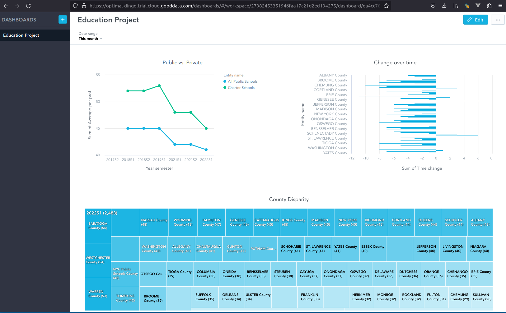

# Data Engineering Zoomcamp Project - By Christian Ruiz in March 2023
## Introduction
Welcome to my Project for the Data Engineering Zoomcamp 2023. The structure of this document should guide you through the project and follows also the grading logic step by step.

The data source that I will be using is from the New York State Education Department and contains data on school assessment results on several school contents (math and science scores, English Language Arts (ELA) and so on) and by several types of schools, by counties and so on. An overview over the datasets can be seen here: 
https://data.nysed.gov/downloads.php
That link I found provided in the lists of datasets that was given to us in the data engineering zoomcamp repo, more specifically I found it in the following list under education: 
https://github.com/awesomedata/awesome-public-datasets#education

The reasons for selecting that dataset was a genuine interest in the education sector, but also choosing datasets that are large (hundreds of MB per school year) and that are similar in what we have seen in the Data Engineering Zoomcamp this year.


## Problem description

We are abording our problem as if we were researchers in educational policies or working for the education department of New York itself. In a nutshell, we want to know where the school children fare the best: are the scores influenced by types of school and geographic location? This would enable us to make decisions to improve education. More exactly the following questions will be analyzed in this project:
1) Are the grades of children in certain types of school (e.g. private schools) higher than in others (e.g. public schools)? 
2) Is there a regional disparity among counties? E.g. do the children in some of the counties fare better than in others?
3) Applying to both questions 1 and 2: Do we observe a change over time in these dimensions? 

From a data engineering perspective, there is also a technical problem as a longitudinal analysis is only possible if the files from the large zip files are extracted and then somehow added together. It is thus a nice dataset to apply what we learned in this zoomcamp, and to combine the technical difficulties with the analytical insights into the scores from the pupils. 

## Reproducibility

Reproducibility is an element mentioned at the very end of the grading schema of the projects, but it might be worth it to say already something at the very beginning.

First of all: one challenge with the data is that it is in Microsoft Access DB format. In Linux you will first have to install:
sudo apt install mdbtools

I will use a virtual environment for this project that will not be in the repo. Create one either via anaconda or with venv. As I personally prefer venv I do: python3.9 -m venv .venv
Then you can run the virtual environment with source .venv/bin/activate
Next there are some packages that you might need and that are in the requirements.txt file: 
pip install -r requirements.txt

Prefect will need the preparations as we did it in the video. I will run a local prefect, but the blocks (credentials) have to be configured and so on.

Spark will need jars to be downloaded for bigquery and gcs access (as shown in the advanced videos). The spark-script points to the jars and to my credentials. There are things to adapt.

The dashboard is made with gooddata directly accessing the bigquery data. I used gooddata as I was confused at the beginning with looker and looker studio. When I realized that looker studio is free (as opposed to looker), I was already using gooddata. Anyway, it is just an alternative dashboard solution.

All of the scripts are described with comments. 


## Cloud

We will use cloud and IaC tools in this project: Google Cloud Storage for the data lake, Google Big Query further down for the DWH, and terraform for setting up all the elements. 

For reproducibility of terraform and the cloud elements, I have put the terraform elements here in the sub-folder terraform. You have to set your own project-id to be able to reproduce terraform, and also have set the google auth beforehand. Step by step:
1) open console
2) cd terraform (if you are in the main folder of this repo)
3) gcloud auth application-default login (in order to auth to gcp. The necessary preparation as in the videos has to be made beforehand)
4) Change in terraform/variables.tf the value of your project-id in line 7. At the moment you see there my project-id used. Just replace by your own.
5) terraform init
6) terraform plan
7) terraform apply
8) (at the very end of this project do not forget to terraform destroy)

The terraform will do two things:
1) It will create a Google Cloud Storage bucket called education_data_lake. 
2) It will create a Google Big Query database called education_database.


## Data ingestion of type Batch

The solution is an end-to-end pipeline with multiple steps int he DAG and fully orchestrated.

For that I took the precect-based solution of script of week 2 and then modified it accordingly for this use-case. You can see the script in this repo under etl_web_to_gcs.py. 

It does the following steps:
1) The etl_parent_flow is executed with a list of years to process. Basically the data is contained per year, so every year has to be downloaded and processed. 
2) For every year the flow etl_web_to_gcs is called. It prepares the strings for the file-name and the url and then runs all of the tasks in the pipeline. 
3) First, the zip-files are being downloaded.
4) Then they are being extracted
5) Then we have to find the name of the accdb-file, as it is not always in the same logic.
6) For all of the 3 subjects there will be:
    a) extraction of the respective table in the accdb file
    b) Processing of that table
7) A concatenation of the three generated dataframes for each subject
8) The writing to a local parquet file
9) The writingof the parquet file to gcs

The actual data processing steps does the following:
1) ENTITY_NAME should only contain all the public schools, all the charter schools as well as all the data from counties.
2) SUBGROUP_NAME should be only filtered to all_students (more analyses would be possible for male/female, ethnic backgrounds etc.)
3) The assessments for the 8th level (highest level) will be selected only
4) Year is split into a year_semester combination, as the data of an input-file contains the last semester of the previous year, plus the first semester of the current year (e.g. 2021 semester 2 and 2022 semester 1).


Here is the overview over the entities that are kept (See that it contains all counties plus 'All Public Schools' And 'Charter Schools'):

```python
array(['All Public Schools', 'ALBANY County', 'ALLEGANY County',
       'BROOME County', 'CATTARAUGUS County', 'CAYUGA County',
       'CHAUTAUQUA County', 'CHEMUNG County', 'CHENANGO County',
       'CLINTON County', 'COLUMBIA County', 'CORTLAND County',
       'DELAWARE County', 'DUTCHESS County', 'ERIE County',
       'ESSEX County', 'FRANKLIN County', 'FULTON County',
       'GENESEE County', 'GREENE County', 'HAMILTON County',
       'ONONDAGA County', 'ONTARIO County', 'ORANGE County',
       'ORLEANS County', 'HERKIMER County', 'JEFFERSON County',
       'LEWIS County', 'LIVINGSTON County', 'MADISON County',
       'MONROE County', 'MONTGOMERY County', 'NASSAU County',
       'NEW YORK County', 'BRONX County', 'KINGS County', 'QUEENS County',
       'RICHMOND County', 'NIAGARA County', 'ONEIDA County',
       'OSWEGO County', 'OTSEGO County', 'PUTNAM County',
       'RENSSELAER County', 'ROCKLAND County', 'ST. LAWRENCE County',
       'SARATOGA County', 'SCHENECTADY County', 'SCHOHARIE County',
       'SCHUYLER County', 'SENECA County', 'STEUBEN County',
       'SUFFOLK County', 'SULLIVAN County', 'TIOGA County',
       'TOMPKINS County', 'ULSTER County', 'WARREN County',
       'WASHINGTON County', 'WAYNE County', 'WESTCHESTER County',
       'WYOMING County', 'YATES County', 'NYC Public Schools County',
       'Charter Schools'], dtype=object)
```


For reproducibility, you need to :
1) prefect orion start
2) then start a worker with prefect agent start --work-queue "default"
3) and then start prefect deployment build etl_web_to_gcs.py:etl_parent_flow -n "Education Project Flow"
4) prefect deployment apply etl_parent_flow-deployment.yaml
5) prefect deployment run 'etl-parent-flow/Education Project Flow'


## Data Warehouse

I am using Google BigQuery. In the following section after this one, the spark-script will take the parquet data in the gcs data lake, transform it, and write two outputs in the Google BigQuery data warehouse. As we have seen in the course, the partitioning and clustering is only made if it makes sense. In this case, it will not make sense of any of the two tables that are going to be written to Google BigQuery. It would be a mistake to cluster and partition them, as the resulting amount of rows after the spark transformations will be very low:

- Cluster does not make sense, as only a couple of columns will be left anyway.
- Partitioning does not make sense, as even though there is a year_semester variable (which would somehow fit), the amount of data is so low, that it would be more than an data-engineering.

So I still hope to get this point for having made the right analysis about cluster and partitioning even if not using it.


## Transformations with spark

The transformations are defined with spark. You can run the file spark_education_gcs_bigquery.py for reproducibility. Note that you will have to prepare a spark-environment similar as seen in the videos. Plus the two jars for accessing gcs and for writing to bigquery have to be prepared as described in the videos. 

The transformations in the script will do the following.

1. Load in the GCS parquet files all at once (they were generated in a stackable form).
2. Make a wide table out of the three different forms of assignments (what I call subjects). Now you have the three subjects in the same row for every interesting observation (entity and year_semester)
3. Calculate an average score for these three subjects. Remove the others. 
4. Make a second dataframe, as another wide table by year_semesters.
5. This enables to take the difference between the newest and the oldest year. 
6. By calculating this difference we have it easily prepared for the dashboard later
7. Finally write both tables to bigquery


## Dashboard

The dashboard with the 3 tiles is shown in the following image:



First of all, we answer the question defined in the problem statement about the difference between public and private ('Charter') schools. The first tile on the top-left, shows that private schools fared better than public schools. This is constant over the entire observed time period. However, interestingly we see a trend of deterioration in both types of schools over time. And more than that, the deterioration was stronger for private schools than public schools. So we we had a gap of 7% in the beginning of 2018, it melted to 4% in 2022. Thus, while in private schools 45% of pupils pass the 8th level in 2022, only 41%of pupils pass.

Second, the tile on the bottom answers the second question and shows that there is a dramatic disparity among the counties. While there are counties, where over 50% of children pass the exam (shown in darker blue), there are counties where approximately only every 4th kid does (shown in lighter blue), Thus, there is a disparity where only half of the children pass the exam in the worst performing counties as compared to the best performing counties!

Lastly, the tile on the top-right shows that there seems to have been a dramatic deterioration over time of pupil performance over almost all the counties.

The questions asked have thus been answered. Further research would be necessary to look into details about the reasons, why the performance deteriorated so strongly. Maybe the corona-virus is an important part of the answer - however a slight trend of deterioration was already present before the onset of the virus.

## Conclusion

For this project the following thing shave been made:
- Dataset selected fitting to this course
- Problem lenghtly described
- Cloud: Using IaC tools (Terraform)
- Data ingestion with back, end-to-end-pipeline, multiple steps in DAG, uploading data to a data lake
- Data warehouse: tables used without partitioning and clustering as it would not make sense to activate it here
- Transformations: with spark
- Dashboard with 3 tiles
- Reproducibility: Scripts can be run directly. Necessary preparation like in videos for prefect, spark (jars) etc.


